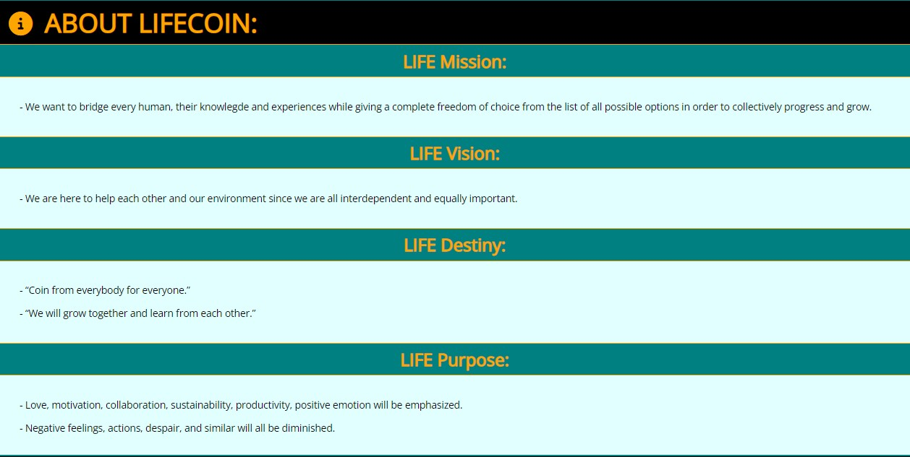

# Life Coin

Life Coin site is a digital representation of an interaction platform powering an alternative and independent new economy system. The reason for the development of this site is to slowly introduce to the public this innovative and collaborative environment for purposes of financial education, poverty reduction, and improvement of lifestyles while achieving life-long goals. This site is for every human's personal and business use no matter their unique life experiences.

 In our live public area, all humans are encouraged to contribute and grow together towards a better tomorrow. Users will be able to join our public workspace where they can increase and store their wealth through various missions offers and financial tools. All efforts are additionally rewarded with infinite options to purchase from real-world service providers with extremely large discounts. Our focus will always remain on only supporting sustainable products and services. While covering one of the key aspects of life, users are also paying unnoticeable taxation that transparently funds the charity and business missions.

------

## Features 

In the first demonstrative version, minimum features have been disclosed in order to create a rich experience for users over longer periods of time. Also,  for initial attention from investors, a large amount of information has been summarized to cover main topics and categories before planned full disclosure. We will continue to improve consistently while strategically releasing new content and features according to our planned agenda. This site is made fully responsive across variety of devices with lowest guaranteed width of 280px for new age foldeable screens. Next size is normal phones, tablet portrait, landscape, laptop, PC and larger.

### Existing Features

- __Navigation Bar__

  Consistently repeating on all nine pages, a fully responsive navigation bar includes the Title area, main menu, and sub-menu. The main background is a very light blue background instead of plain white adding some life to an unknown concept while fitting well and discreetly between the main site's colors orange and teal.
  
  - Title is created out of a professional custom-made unique logo next to the products name styled in CSS to match the colors of the logo and all Earth's elements since it is a Life Coin. Both are linked back to the home page across all pages

  - The main teal menu is leading users to the main four categories of the page: Home, Recruitment, Journey, and Register. Active page indication coloring in orange is included. Page is shown in PC screen sizes next to the main title while in tablet and phone sizes are placed under the title stretching across the entire screen

  - Sub-menu in the black background color serves the purpose of dividing content according to the main categories of the page. Teal font coloring is included for a smoother transition and better connection to the main menu bar's visually for users. Sizing is smaller in comparison to the main menu in order to emphasize its importance. Active sub-menu coloring has been included as well as proper functioning links on each navigational button. Positioning is under the main menu for phones and tablets users while for PC users, it is found under the both title and main menu stretching across the screen dividing area between headers and navigation on each page
  
  - Strategical and categorical division allows users to easily navigate from page to page across all devices without having to return back to the previous page via the ‘back’ button in the browser. This is extremely helpful when getting to know a new service or a website

  
  
  

  

- __Landing Video__

  - The landing includes a professional custom-made promotional video that features main Earth's elements hinting at the overall team of this brand

  - This section introduces the user to Life Coin with an eye-catching sharp and creative animation to grab their attention and increase the chances for a great first impression

  - This video is auto-played but not looped so it does not distract users from reading the bottom content with active autoplay sound. The user is given a control bar to give full control on replaying the missed content in any circumstance of user distraction, internal or external. Video is larger for phones and tablets websites while for PC is not too large to guide users to the next section easier. Due to the control bar user is in full control of his ultimate first experience with the site

  

- __Landing Quotation__

  - Calming effect of the sunset background is allowing users to gradually enter the feeling of reflecting back on life and planning the future during the natural sun's cycles and impact on the human mind and body. This is where users can be shortly debriefed on how besides these visuals, service can bring utility value to them and allow more sunsets in a more comfortable situation for them and the close ones. Being one of the hints of solutions for users' problems or ideas font is given the subtle effect of glowing as it seems to be an answer falling from the sky. Colors have been picked from the top division of colors focusing on purple and black as their location on the page is also on the top. This also builds subliminal users' natural ability to further digest and separate high quantities of quality content

  

- __About Section__

  - Once users' attention is present from landing elements, some highly important and new summarized information is given following the graphic media and captivating quotation. Here, the main business aspects, values, and predicted journey is disclosed to the user as an about section or personal introduction for users to understand our positive intentions better and earlier

  - Styling has been added to emphasize horizontal division with a black background such as the sub-menu's role. Orange color brings deliberate high contrast to guide users from the first-impression stage over the smooth bridge to the actual content. Again, the teal background indicates a boxed divider such as nav-menu to break down areas in familiar patterns for users

  

- __Home Headers__

  - The similar pattern landing image media includes an interactive photograph custom made for this website with color alternation to demonstrate the main topics and sections of the predominately informative home page. Headers with blue and white colors are representing the following features section where blue skies and white sun and clouds are the main visuals. Orange and teal headers are the main colors and therefore subliminally indicate this is the most important area that contains the full agenda and timeline of the Life Coin. This is the site's business strategy and priority highest priority next to the private sale. For a private sale, the header is black to create a full stop and divide the important region and upon interaction also transparent showing through true body color as a deep metaphor or creating a feeling of "transparency" when dealing with our financial service and project now or in the future
  
  

  

  

- __Features Section__

  - First main sections of the home page has been done with the best background visuals in order to step-by-step bring users from stage of introduction to content with basic background and font to the full-scale first-hand experience of participating in our life reality and services

  - Having bright yellow color in the middle of the logo has been an inspiration to use a sun background as the title rises over the fixed blue skies on the scroll separating all Life Coin's service features. This section is one of the most important ones for potential investors and has been done with a special design in order to always remind them when they look up at the sky

  

  

- __Timeline Section__

  - Another home page main section that through the main colors of the site and sleek clean and sharp text-shadow backgrounds creates a categorized easy-to-digest process for users going through both agendas. Short-term and long-term have been clearly divided with the horizontal teal box while main content has been ordered through yearly quarters and plans for users. This is also of high importance to investors but this time even for the team and community to know which periods and products are upcoming next

  

- __Private Sale Section__

  - Being a unique coin in the entire universe that develops in a direction of universal physical and digital currency for the whole Earth and beyond, the star background has been added to the pre-sale section. Teal boxes for content are fitting well with a background image of stars and orange coloring is used to emphasize the most important segments: tile, subtitle, network, crypto addresses, contact, registration form link, and a launch date. There is an additional thin top banner with a button indicating the private sale is live while viewing the header without the need to scroll down to be able to jump right in

  

  

- __Recruitment__

  - Following the home page, the second largest out of 4 sub-pages of the Life Coin site is oriented towards building relationships with the users after all values and solutions have been presented. The landing recruitment page allows users to explore and determine if they would like to join our business team, build a relationship with our business, or register as actual consumers and community members. Those three categories of users have been each assigned a button to follow to the belonging page where further and detailed information is disclosed. Each button has a descriptive sentence to indicate the next destination through a formal palette of colors shades on teal with sharp orange emphasis color. The header is of complimenting colors and coin design on it contracts within itself as a hovering effect such as pressing a button, subliminally telling the user he needs to select his one single button. As the screen size drops below PC size, the header picture is not anymore floating left of the content boxes, but stretching full width above the content boxes

  

- __Team Recruitment__

  - Since the brand's associated products and services are based on education and business progress, the main font background and coloring for employees and contractors recruitment is designed inspired by a traditional chalkboard. Information that is written there for everyone will stay as permanent as the chalk and all the promises will be kept that user can benefit from in this section. In addition, the presented list of all urgent positions sought opens real-life opportunities for all users. Main sections such as the title for the careers and subtitle per job advertising segment are again colored with the main colors of the page teal and orange. This time, another icon is introduced in order to add some variety to the visuals. Background color to hovering over the floating coin and all content has been matched with the body color and navigational menu light blue color to add the natural spacing instead of using white color to sloppy cut through smooth water/green experience offered to users through including various shades of teal

  

- __Business Recruitment__

  - Almost identical concept to the Team Recruitment features. The only difference is that different type of users browses and uses this part of the site to grow business relationships, while another user follows other pathways such as joining the community as a consumer or Team as an employee or contractor. Styling difference to give some distinction is in the main board with an explanation of the title Business Symbiosis. Since the user could make many assumptions or give up not knowing, an informative block has been added with a sleek modern styling division between concepts and board advertisement. In contrast to the Team page where the user automatically understands the concept almost intuitively by seeing many job postings that page with employment environment description, conditions, payment, open positions, and similar. Here user needs to be given a small explanation banner. Boxes on the business relationship page are slightly more distanced for better division between concepts emphasizing different models and possibilities for users with capitalization and font-increase of the keywords of each single box

  

- __Journey__

  - Usually when users stumble on the page with a big orange cone with a wording construction and that page is not built yet. This user rarely comes back bumping into a brick wall without any time frame for "construction works". What is trying to be achieved for our users in this part of the site is to disclose to the user that there are more features and plans in making or that we even completed the next version without losing the excitement and smooth navigation. Instead, we are informing the user that one of our completed sections cannot be open due to certain agenda milestones and already planned dates for launch. This converts any disappointing energy into pure enthusiasm about the version update date. The user gains another advantage of constantly positively looking forward to the next release while still being briefly introduced to the concept of the new page. Having gifts locked instead of them being built in a "boring" factory, makes a child's brain want them even more 

  - Once the target date reaches, this segment will allow the user to see exactly when the public meetings will happen, in which online or offline room, and how long they will last next to the disclosure of the main topic or topics. The full site will eventually turn into full-scale progress collaboration software and a social network. Orange color dominates here as subtle information of construction progress which is usually associated with orange, not teal color. However, a user is primarily being guided to think it is locked and ready to launch for a better long-term experience with strategic releasement of versions previously discussed

  

- __Registration__

  - The registration form will allow the user to fully integrate into the community, as well as the benefits to customize upcoming life experiences based on personal preferences or past. By completing this short online form, users' life will significantly change their daily schedule towards the life they always dreamed about without hurting others. Healthy habits and services will be introduced immediately to users. Once that new versions of this site will be released, they will be able to specify which exact tasks they want to create for themselves or others or even join already posted global tasks and missions. 

  

  

  

- __The Footer__ 

  - The footer section includes links to the selected few social media sites for Life Coin. The links will open to a new tab to allow easy navigation for the user and to keep our site always open. Footer is very important to the users since it gives further options to visit that expand to other widely used sites, connect with the Team, and even directly contact with any requests or problems. Footer is broken down into two parts, both made up of the main site's colors orange and teal. The first one consists of strictly recognized social platforms, while the second part offers direct contact information of the site and brand. Main inspiration for the background was black volcanic sand which gets very hot with the sun (light) reaching it. In full PC mode, users can see the video as if they are holding the phone above the sand standing up. And the form has zoomed-in background to the sand, as if user has already looked down in the sand and found a form while watching a video

  

### Upcoming Features

  - __Projects and missions collaboration page__ 
  - __Personal wishlist for users__ 
  - __Navigation title links per color in each letter__ 
  - __Gallery__ 
  - __Two factor authetification__ 
  - __Secure log-in system__ 
  - __Form data receiving page__ 
  - __Sponsors footer__ 
  - __Partnerships footer__ 
  - __Testimonials__ 
  - __Map__ 
  - __Countdown__ 
  - __Traffic monitor__ 
  - __Users count__ 
  - __Whitepaper__ 
  - __Legal protection__ 
  - __Community voting__ 
  - __Team page and profiles__ 
  - __Business partners page__ 
  - __Refferals__ 
  
---

## Testing 

- I have conducted enough hours of testing across all screen sizes and different browsers to conclude that now site works well and all discussed features included. Internet Explorer, Google Chrome, Safari, Firefox on large PC monitor, average laptop, tablet and various mobile devices.

- Only bug that has not been addressed is sun background image on the features site used as a subtitle. Due to only beginning to code, developer needs to cover next topics in order to create proper animation of sun and clouds.

### Validator Testing 

- HTML
  - No errors were returned when passing through the official [W3C validator](https://validator.w3.org)

- CSS
  - No errors were found when passing through the official [(Jigsaw) validator](https://jigsaw.w3.org/css-validator)

- Accessibility
  - This test confirms that the colors and fonts chosen are easy to read and accessible. All scores are satisfactory besides performance since the site uses complex visuals and large media which will be solved with the next update. All common practices and SEO levels have passed with a full percentage

  

### Bugs

Since all code is running smoothly and has been verified from the first attempt, there were no bugs left to solve.

---

## Deployment

- The site was deployed to GitHub pages. The steps to deploy are as follows: 
  - In the GitHub repository, navigate to the Settings tab 
  - From the source section drop-down menu, select the Master Branch
  - Once the master branch has been selected, the page will be automatically refreshed with a detailed ribbon display to indicate the successful deployment. 

The live link can be found here - https://bono-94.github.io/Project-1-Code-Institute-HTML-CSS/ 

---

## Credits 

### Content 
  

  - All content and code are 100% unique and custom-made per request for a client in order to prevent any legal issues in the future

  - All content, concept, and visuals have been exclusively written for this site

  - Code structure is also 100% original and completely created by a developer. A developer has followed HTML and CSS course at Code Institute where theory on building blocks has been taught. After reading through knowledge materials to see what are possibilities of creating this site, general blocks have been put together to create original work. Given completed examples have not been plagiarized but served as a general guide from a client for a developer. Finally, the README structure has been used from Code Institute in this project in order to be created under the industry standards and expectations. A general repository created for students before commencing their project for convenience has been imported before the first coding lines. Project requirements have been used as secondary rough guidelines for the content structure

  - All debugging and problem-solving has been done strictly by trying different combinations with known and unknown elements and attributes. No external sources and no professional help 
 
  - Instructions on how to use various unexplored elements and attributes were consulted with [W3 Schools](https://www.w3schools.com/)

### Media

  - Every photo and both videos featuring coins or logos are all original works created specially for this site

  - The background photos on all pages that represent nature have been all downloaded from only 2 external sources:
  
    - [Pexels](https://www.pexels.com/)

    - [Unsplash](https://unsplash.com/)

  - All 3 external fonts have been imported from:
  
    - [Google Fonts](https://fonts.google.com/)\
  
  - All 3 external icons have been imported from:
  
    - [Font Awesome](https://fontawesome.com/)

### Tools

- Grammarly software has been used to verify grammar on the site and this README file

- Nicepage software has been used for initial concept modelling of different potential designs

---
Thank you for READING ME!

